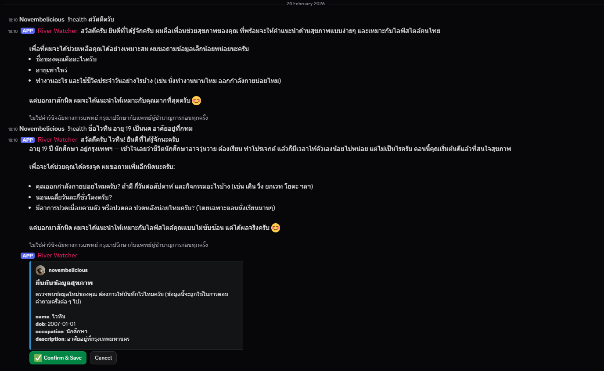
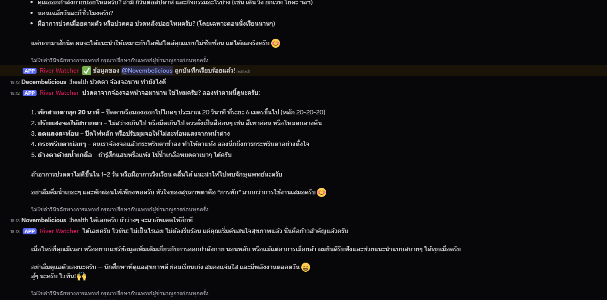

# Discord Health Assistant Chatbot

**แชทบอท Discord เพื่อนคู่สุขภาพ สำหรับอาการ Office Syndrome**

บอทที่ช่วยคุณได้ ถ้าคุณอยากทราบว่า Office Syndrome คืออะไร แล้วตนเองมีความเสี่ยงแค่ไหน เข้ามาอัพเดตและรับคำแนะนำเบื้องต้น สร้างเสริมกิจวัตรที่ดีต่อสุขภาพสำหรับตนเอง

- ชาวไทยมีปัญหาเจ็บป่วยจากการทำงานในสำนักงาน แม้ตั้งแต่ก่อนช่วงภัยโรคระบาด  
- อาการดังกล่าวทำให้เกิดการสูญเสียทั้งสุขภาพ และทางเศรษฐกิจโดยรวม  
- อัตราการใช้งาน Discord ในสำนักงานมีแนวโน้มสูงขึ้น จากการ rebrand ให้เป็นพื้นที่สนทนาสำหรับคนทุกวัย ทุกกลุ่มเป้าหมาย  

สิ่งที่แชทบอทนี้ช่วยได้:  
- ตอบคำถาม และให้คำแนะนำสุขภาพทั่วไปและเกี่ยวกับ Office Syndrome อย่างเข้าใจง่าย  
- เสริมข้อมูลเกี่ยวกับอาการ Office Syndrome ภัยเงียบยอดนิยมสำหรับวัยทำงาน  
- Update ข้อมูลผู้ใช้ จากข้อความธรรมชาติ  
- บันทึกข้อมูล วิเคราะห์เทรนด์สุขภาพ และสรุปสุขภาพรายวันแบบรายบุคคล  

*ไม่ใช่คำวินิจฉัยทางการแพทย์ กรุณาปรึกษากับแพทย์ผู้ชำนาญการก่อนทุกครั้ง*

## ตัวอย่าง  

### การใช้งานเบื้องต้น

  
*ส่งข้อความครั้งแรก (ใช้ใน channel รวม ต้องมี `!health` นำหน้า)*  

  
*ระหว่างรอคำตอบ*  

  
*ได้คำตอบแล้ว และเมื่อตรวจพบข้อมูลผู้ใช้ที่อัพเดตได้ จะสร้างหน้าต่างเพื่อยืนยัน ถ้า Confirm & Save ข้อมูลจะอยู่ใน database เพื่อเอาไปใช้งานต่อไป*  

  
*สรุปรายวัน จาก `/summary`*  

### การใช้งานใน channel รวม กรณีมีการใช้งานพร้อมกันหลายคน

 
*เริ่มใหม่ ล้างข้อมูลแล้วลองทักทายดู*  

 
*โอ้พระสงฆ์ `@decembelicious` ดันมาขัดจังหวะสนทนาจนได้ แต่ก็ไม่เป็นไร เพราะบอทแแยกแยะได้ว่าข้อความไหนส่งให้ใคร*  

 
*ลองใช้ `/summary` พบว่าบอทเข้าถึงข้อมูลได้อย่างที่ควรจะเป็น (`@decembelicious` ยังไม่ได้บันทึกข้อมูลใด ๆ ใน database เลย ทำให้ในกล่องข้อความแสดงผลดังภาพ)*  

## พรรณนาสรรพคุณ

### **Discord** 

ตัวบอทใช้ prefix `!health` ในห้องแชทรวม ใช้ prefix ดังกล่าวนำหน้าข้อความ เพื่อรับการตอบกลับจากบอทใน channel นั้น (ไม่ต้องมี ใน DM) รองรับ 6 slash command ดังนี้

- `/summary`: สร้าง embed สรุปประจำวัน
- `/log`: กรอกข้อมูลสุขภาพประจำวัน (จำนวนก้าวเดิน, active minutes, etc.)
- `/update-user`: ใช้ update ข้อมูลผู้ใช้อย่างเดียว ไม่ส่งข้อความตอบกลับ  
- `/ask`: ตอบกลับผู้ใช้ ไม่สกัดข้อมูล
- `/askraw`: ตอบกลับผู้ใช้ ไม่สกัดข้อมูล และบังคับไม่ดึง RAG กับข้อมูลส่วนบุคคล 
- `/reset-user`: ลบข้อมูลจาก database

### **Langchain / Langgraph** 

การเรียกคำตอบแต่ละครั้ง สามารถวาดเป็น flow/graph (รูปล่าง) ด้วย flow นี้ LLM สามารถทำ API call เป็นลำดับที่วางไว้ เพื่อตัดสินใจได้มากกว่าเดิม

 

### **RAG**   

จาก file ใน folder `source/` นำไป process ผ่าน `tools_chunking/office_chunking.py` ได้ vector database (Chroma) ใน folder `db/`  

| Version | Source | Chroma  |
|-----|---------------|---------------- |
| ver1 | `source/txt_office_syndrome_v1.txt` | `db/office-syndrome-v1.db/` |
| ver2 | `source/txt_office_syndrome.txt` | `db/office-syndrome.db/` |

### **Database Schema (SQLite)**

มีฐานข้อมูล SQLite `db/users.db` เพื่อเก็บข้อมูลพื้นฐานผู้ใช้  
อ้างอิงโครงสร้างได้จาก `db/sql/create_tables.sql` LLM รู้ว่าตัวเองสามารถขอข้อมูลอะไรจากผู้ใช้ได้จาก prompt

สิ่งที่เก็บ:
1) ข้อมูลประจำตัว (เปลี่ยนไม่บ่อยครั้ง): name, date of birth / age, gender, job, lifestyle, medical conditions, height, weight
2) ข้อมูลรายวัน: steps, calories burned, avg heart rate, active minutes, sleep hours

## สำหรับ host

> Run `app.py`

- **แก้ชื่อ `env.txt` เป็น `.env` และใส่ token ก่อน**  
    มีแค่ `DISCORD_TOKEN` `OPENTYPHOON_API_KEY` กับ `GOOGLE_API_KEY` ที่ต้องใส่จริง ๆ ที่เหลือเว้นไว้ได้
- **ดูชื่อ model ใน `chat.py` ด้วย**  
    ~~ตั้ง global variable เป็น `ALTER = False` ถ้าจะใช้ Gemini เพราะถ้าตั้ง `ALTER = True` จะเรียกใช้ chat ของ Typhoon กับ embedding ของ OpenAI แทน~~  
      
    ตั้ง `ALTER = True`

## **อื่น ๆ**  

- มี `requirements.txt`
- มี file ใน `test_tools` เพื่อเรียก API ตรง ๆ ไม่ผ่าน Discord  
- ย้าย system prompt ไว้ใน `default_context.json` ทั้งหมดแล้ว
- ยังมี `db/nih-chroma/` อยู่  

## แหล่งอ้างอิง

บทความที่เกี่ยวข้อง
- [เจ็บป่วยจากการทำงานหน้าคอมฯ ภัยใกล้ตัวของคนทำงานออฟฟิศ-ทำงานที่บ้าน - OKMD Knowledge Portal](https://knowledgeportal.okmd.or.th/article/6478624920611)  
- [Discord Revenue and Usage Statistics (2026) - David Curry](https://www.businessofapps.com/data/discord-statistics/)  

Code
- Crash courses - Harish Neel  
[Langchain](https://github.com/harishneel1/langchain-course/tree/main/)  
[Langgraph](https://github.com/harishneel1/langgraph)  

- นำโมเดล RAG ในรูป chroma db ใช้ประกอบการ generate  
[RAG Agent](https://github.com/aliceheiman/YouTube/blob/main/nih-rag/)
