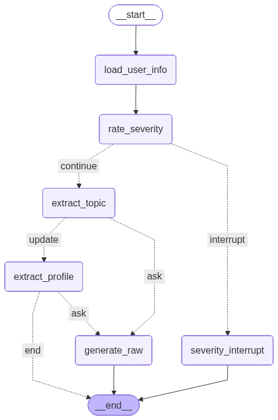

# บอทดิสคอร์ด ที่โหดที่สุดใน ๒๐๒๖ ใหญ่

> Run `app.py`

- Langchain + Langgraph  
- RAG + ดึง database ผู้ใช้  
- Summary รายวัน  
- Update database ได้จาก input ภาษาธรรมชาติ

## Feature (?)

- **Discord**  feature ตอนนี้  
    * `!health`: interaction หลักของบอท  
    * `/ask`: คล้าย ๆ `!health`  
    * `/askraw`: คล้าย ๆ `!health` แต่บังคับไม่ใช้ RAG  
    * `/summary`: สร้าง embed สรุปประจำวัน  

    (โซนนี้ยังใช้ไม่ได้)  
    * `/update-user`: ใช้ update ข้อมูลผู้ใช้โดยตรง  
    * `/reset-user`: ลบข้อมูลจาก database * 

- **Langchain + Langgraph** การเรียกคำตอบแต่ละครั้ง สามารถวาดเป็น flow/graph (รูปล่างสุด) ด้วย flow นี้ LLM สามารถทำ tool calling แบบต่าง ๆ เป็นลำดับที่วางไว้เพื่อตัดสินใจได้ดีกว่าเดิม

- **Summary**  

- **RAG**   จาก file `tools_chunking/txt_office_syndrome.txt` นำไป process ผ่าน `test_tools/office_chunking` ได้ vector database (Chroma) `db/office-syndrome.db/`

- **Database Schema (SQLite)** มี `db/users.db` เพื่อเก็บข้อมูลพื้นฐานผู้ใช้  
อ้างอิงโครงสร้างจาก `db/sql/create_tables.sql` ได้  

- **อื่น ๆ**  
    * ยังมี `db/nih-chroma/` อยู่  
    * มี file ใน `test_tools` เพื่อเรียก API ตรง ๆ ไม่ผ่าน Discord  
    * เพิ่ม `requirements.txt`

  
*Workflow*  

  
*ไม่ใช่ Gemini ผลลัพธ์แปลก ๆ แต่ก็ถือว่าใช้ได้อยู่ มั้ง*

## การติดตั้ง (?)

1. **แก้ชื่อ `env.txt` เป็น `.env` และใส่ token ก่อน**  
มีแค่ DISCORD_TOKEN กับ GOOGLE_API_KEY ที่ต้องใส่จริง ๆ ที่เหลือเว้นไว้ได้

2. **ดูชื่อ model ใน `chat.py` ด้วย**  
 ตั้ง global variable เป็น `ALTER = False` ถ้าจะใช้ Gemini เพราะถ้าตั้ง `ALTER = True` จะเรียกใช้ chat ของ Typhoon กับ embedding ของ OpenAI แทน 

## แหล่งอ้างอิง

- Harish Neel: Crash courses  
[Langchain](https://github.com/harishneel1/langchain-course/tree/main/)  
[Langgraph](https://github.com/harishneel1/langgraph)  

- นำโมเดล RAG ในรูป chroma db ใช้ประกอบการ generate  
[RAG Agent](https://github.com/aliceheiman/YouTube/blob/main/nih-rag/)

- เชื่อมต่อ Database เพื่อเก็บข้อมูลผู้ใช้  
[SQL Agent](https://github.com/Mayurji/Explore-Libraries/blob/main/SQL-Agent/) 
